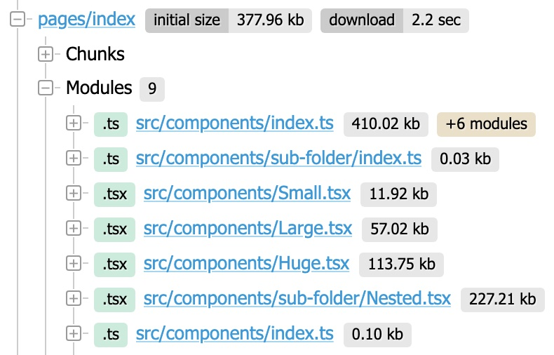

# Barrel files optimization

The aim of this repo is to proove that we can use the `modularizeImports` config
option together with Typescript module aliases to optimize the barrel files we
have in our core project.

## How?

This app has a `components` folder that exports 4 components using a barrel file:

- `<Small />` which contains **10kb** of text;
- `<Large />` which contains **50kb** of text;
- `<Huge />` which contains **100kb** of text;
- `<Nested />` which contains **200kb** of text and it's re-exported from the `sub-folder` folder;

In the tsconfig.json file, there are 2 module aliases defined:

- `@components` that points to `./src/components`, which uses the barrel file;
- `@components/*` that points to `./src/components/*`;

There are 4 simple pages defined, each of which just renders one of the mentioned components:

- `/` renders `<Small />`;
- `/large` renders `<Large />`;
- `/huge` renders `<Huge />`;
- `/nested` renders `<Nested />`;

The components are imported from the module alias that points to the barrel file, e.g. `import { Small } from "@components"`.

---

## Default behavior

According to `next-statoscope`, building the application without any configuration lead to the bundling of all the components together:



The index page uses only the `<Small />` component but the barrel file takes all of them in the chunk.

---

## Using `modularizeImports`

Adding the following configuration to the `next.config.js` we can instruct the bundler on how to resolve our own exports:

```typescript
modularizeImports: {
  "@components": {
    transform: {
      Small: "@components/Small",
      Large: "@components/Large",
      Huge: "@components/Huge",
      Nested: "@components/sub-folder/Nested",
    },
    skipDefaultConversion: true,
  },
},
```

This way we can also handle nested re-exported components with ease, having a much leaner and optimized bundle:


Now the index page only uses its own component losing 97% of its original weight.

---

## Open questions

1. Vercel never mentions that the `modularizeImports` configuration option is meant for local modules, but always talks about external libraries.
   **Is it ok to use it this way? Are there any drawbacks?**
2. It seems that this configuration option is superseeded by `optimizePackageImports` or it is going to be superseeded.
   **Does it make sense to use `modularizeImports` or it's going to be deprecated and then removed soon?**
3. We have a huge application with many barrel files and many nested levels. We thought of building a tool that reads the module aliases and produce the configuration for the `modularizeImports` option. A first purely Typescript approach works but it's rather slow for us.
   **Would it make sense (or is it even possible) to write an SWC plugin in Rust to integrate in the build pipeline?**
